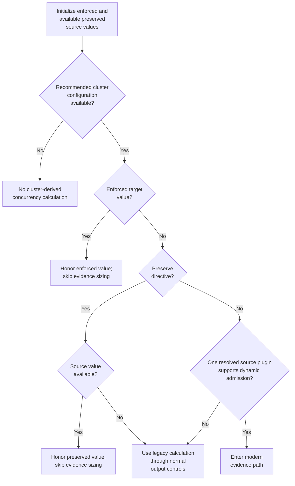
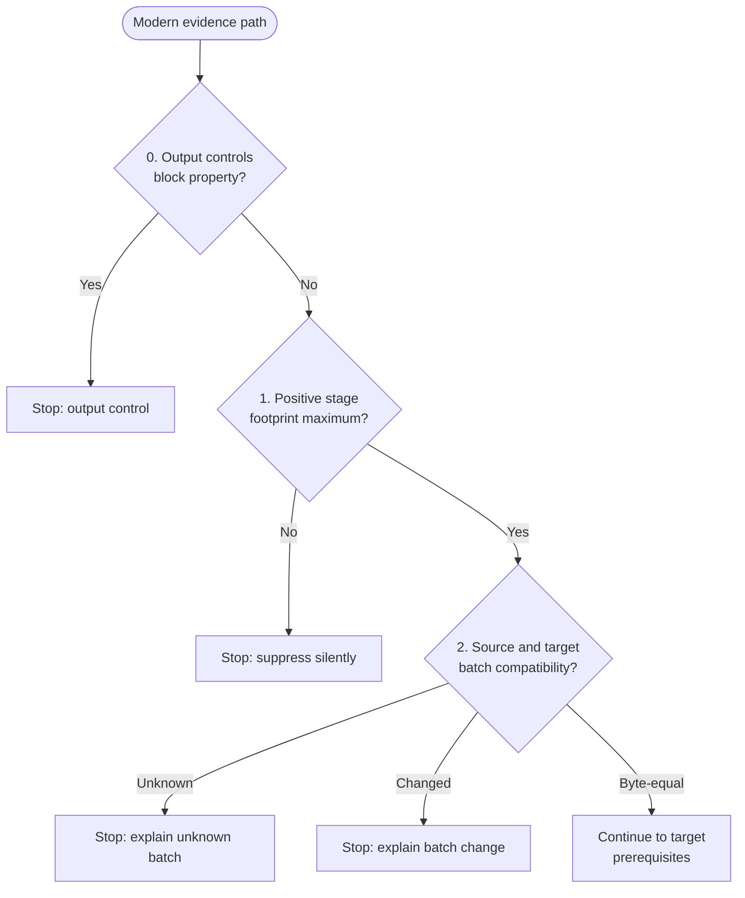
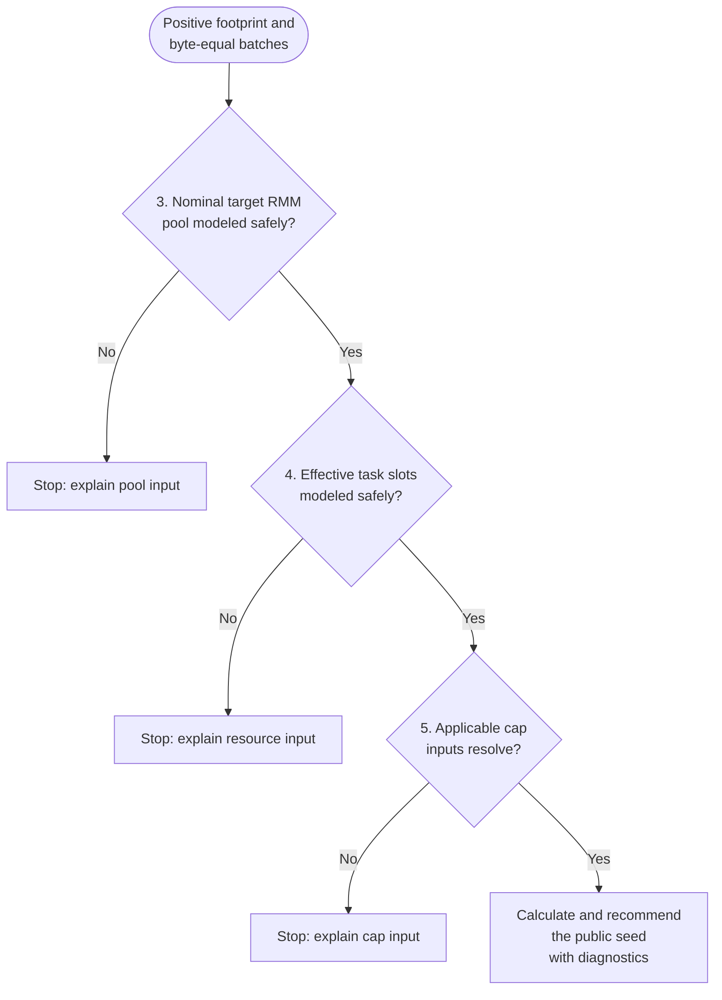
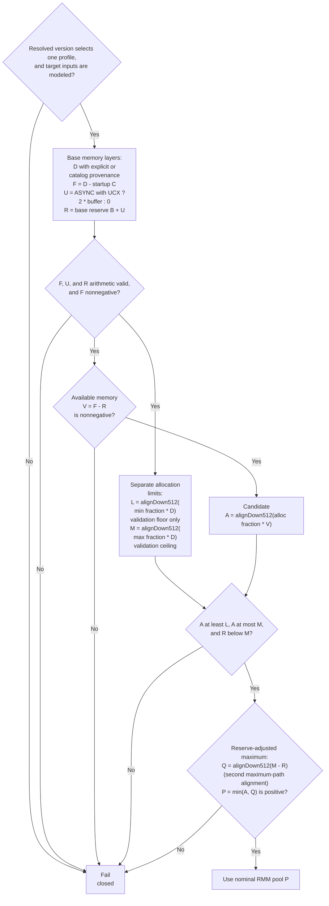
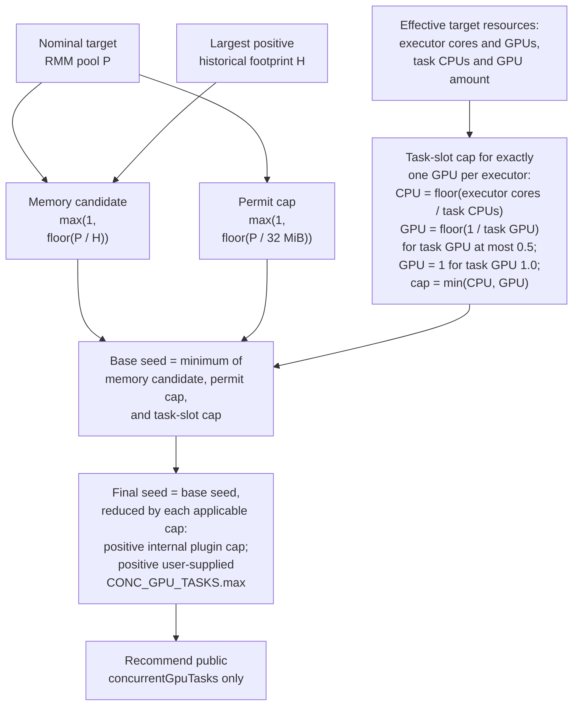

# GPU task concurrency heuristic

[AutoTuner heuristics](README.md)

The GPU task concurrency heuristic recommends the public `spark.rapids.sql.concurrentGpuTasks` property. For a modern RAPIDS plugin, this value is an initial GPU memory-admission seed: the runtime initializes its estimated bytes per task from the initialized RMM pool divided by the seed. It is not a direct limit on the number of simultaneously running tasks. When dynamic adjustment is enabled, the plugin can adjust its executor-local per-stage estimate using observations; the seed-derived estimate can continue to influence early or sparse stage estimates. When dynamic adjustment is disabled, the seed-derived estimate persists.

## Contract

| Category | Behavior |
| --- | --- |
| Recommends | Only `spark.rapids.sql.concurrentGpuTasks`. |
| Applies to | Cluster-level AutoTuner output. Profiling can use historical GPU task-footprint evidence. Older or unresolved plugin versions and Qualification retain the legacy calculation. |
| Reads | The source plugin version, stage-level `gpuMaxTaskFootprint`, source and prospective target `spark.rapids.sql.batchSizeBytes`, target GPU device capacity, effective target RMM settings, effective target Spark task resources, target controls, and applicable count caps. |
| Honors | Enforced and preserved target values, exclusion and caller controls, supported internal plugin count ceilings, and an explicitly supplied AutoTuner maximum. |
| May suppress | When no recommended cluster configuration is available, no cluster-derived value is calculated; an enforced value or available preserved source value initialized earlier can still reach output. Normal controls can exclude, skip, or limit the property. The modern evidence recommendation is also suppressed when evidence is absent, batches are incompatible, or target pool, resource, or cap inputs cannot be modeled safely. Actionable prerequisite failures receive an explanation; absence of usable footprint evidence remains silent. |
| Does not recommend or change | `spark.rapids.sql.maxConcurrentGpuTasks`, batch size, RMM properties, Spark task-resource properties, or `spark.rapids.sql.concurrentGpuTasks.dynamic`. Those values are inputs, independent recommendations, or runtime behavior outside this heuristic. |
| Does not infer | Processing skew, input skew, spill cause, a percentile, or a performance guarantee. Sample count, coefficient of variation, and maximum-over-mean are diagnostics only. |

## Decision flow

The modern evidence path is entered only for one uniquely resolved source plugin version that supports dynamic GPU memory admission. The current minimum version is 25.06.0. A failure inside this path does not fall back to the legacy formula.



| Case | Result |
| --- | --- |
| No recommended cluster configuration | No cluster-derived value is calculated. An enforced value or available preserved source value initialized earlier still reaches output. |
| Target enforces the property | The enforced value initialized earlier is retained; evidence sizing is bypassed. |
| Target preserves the property and the source has a value | The source value is retained. |
| Target preserves the property but the source has no value | The preserve-missing explanation is retained and the legacy calculation runs through normal output controls. |
| No override and one resolved source plugin version supports dynamic admission | Enter the modern evidence path. Dynamic admission support currently begins at plugin 25.06.0. |
| The capability cannot be established | Use the legacy calculation. This includes known older, missing, multiple, or unparseable source versions and current Qualification behavior. |
| The same target property appears in more than one of enforced, preserve, or exclude | Target-cluster validation rejects the overlapping control categories before this routing runs. |

### Modern evidence prerequisites

These two linked diagrams expand the modern evidence terminal above. The first failed gate stops evaluation, and a failure does not fall back to the legacy calculation. Splitting at the byte-equal batch boundary keeps every outcome explicit without producing an oversized diagram.

#### Evidence eligibility and batch compatibility



#### Target modeling and cap prerequisites



| Order | Required state | Failure behavior |
| --- | --- | --- |
| Preflight | Normal output controls allow the property | Suppress through those controls without evaluating evidence. |
| 1 | A largest positive `gpuMaxTaskFootprint` stage maximum exists | Suppress silently. |
| 2 | Source and prospective target batches both parse as positive byte counts and are byte-equal | Unknown compatibility is explained. A known change keeps independent batch handling, explains the change, and suppresses concurrency. Accepted size spellings follow the Spark dependency. |
| 3 | The nominal target RMM pool can be modeled by the selected compatibility profile | Explain the unsupported pool input and suppress. |
| 4 | Effective target task slots per GPU can be modeled | Explain the unsupported resource input and suppress. |
| 5 | Applicable cap inputs resolve | Explain the invalid or unresolved cap and suppress. The inputs are user-supplied `CONC_GPU_TASKS.max` and, when supported by the resolved plugin, the internal `spark.rapids.sql.maxConcurrentGpuTasks`. |
| Success | All gates pass | Calculate and recommend only public `spark.rapids.sql.concurrentGpuTasks`, with diagnostic context. |

Source and prospective target batches are parsed as exact positive byte counts, so equivalent spellings are compatible while even a one-byte difference is not. Known target batch changes continue through independent batch handling even though concurrency is suppressed.

## Nominal RMM pool

The evidence numerator is a nominal target RMM pool, not raw device capacity, current free GPU memory, or an RMM pool measured on a running target. The current compatibility profile models the ordinary discrete-GPU runtime beginning with plugin 25.06.0.



All quantities below are byte counts. `alignDown512(value)` is `value & ~511L`. For fractional products, the implementation converts the nonnegative `Double` result to `Long` before alignment. The rows follow calculation order; any failed requirement produces no nominal pool.

| Order | Name | Exact rule | Role |
| --- | --- | --- | --- |
| 1 | Compatibility profile | Exactly one profile must match the resolved source plugin version. The current `discrete-gpu-rmm-v1` profile begins at 25.06.0 inclusive and has no upper version bound. | Selects runtime defaults, modeled inputs, and 512-byte alignment. No match or multiple matches fail closed. |
| 2 | Target device capacity `D` | Parse the selected per-device capacity as a positive byte count. Its provenance is explicit target configuration when supplied, otherwise the selected or default device-catalog entry. | The model treats `D` as both CUDA total memory and pre-startup free memory. It is not measured free memory. |
| 3 | Modeled target inputs | Resolve target values or profile defaults. Exact allocation must be absent; UVM must be disabled; allocator mode must be `ASYNC`, `DEFAULT`, or `ARENA`, matched case-insensitively; shuffle mode must be `UCX` or `MULTITHREADED`; all three fractions must be finite and between 0 and 1 inclusive; base reserve and chunked-pack sizes must be nonnegative; and the bounce-buffer size must be nonnegative when the ASYNC plus UCX adjustment applies. | Unsupported or invalid inputs fail closed. These are modes modeled by this profile, not the complete set accepted by the plugin. |
| 4 | Chunked-pack startup pool `C` | `C` is the effective `spark.rapids.sql.chunkedPack.poolSize`. | Represents the known allocation made before the plugin queries free memory. |
| 5 | Nominal free memory `F` | `F = subtractExact(D, C)` and `F >= 0`. | Subtracts the known pre-RMM startup allocation. Overflow or `C > D` fails closed. |
| 6 | UCX adjustment `U` | For the `ASYNC` allocator with `UCX` shuffle, `U = multiplyExact(bounceBufferSize, 2)`; otherwise `U = 0`. | Models only the extra pool-sizing reserve for that allocator and shuffle combination. |
| 7 | Effective reserve `R` | `R = addExact(baseReserve, U)`. | Feeds both candidate sizing and the reserve-adjusted maximum. Overflow fails closed. |
| 8 | Minimum allocation `L` | `L = alignDown512(toLong(minAllocFraction * D))`. | Validation floor only. A candidate below `L` fails; the candidate is not raised to `L`. |
| 9 | Maximum allocation `M` | `M = alignDown512(toLong(maxAllocFraction * D))`. | Unreserved validation ceiling and input to the reserve-adjusted maximum. |
| 10 | Available memory after reserve `V` | `V = F - R` and `V >= 0`. | Negative availability fails closed before candidate sizing. |
| 11 | Initial candidate `A` | `A = alignDown512(toLong(allocFraction * V))`. | Candidate derived from nominal free memory after reserve, rather than directly from device capacity. |
| 12 | Ordered guards | Require `A >= L`, then `A <= M`, then `R < M`. | Preserves the implementation's distinct minimum, maximum, and reserve checks. Any failure returns no pool. |
| 13 | Reserve-adjusted maximum `Q` | `Q = alignDown512(M - R)`. | Caps the final pool while preserving the requested reserve. Alignment occurs after subtracting `R` from the already aligned `M`. |
| 14 | Nominal RMM pool `P` | `P = min(A, Q)` and `P > 0`. | Final numerator used by the evidence-sizing heuristic. A nonpositive result fails closed. |

The model treats selected device capacity as both CUDA total memory and pre-startup free memory, then subtracts the known chunked-pack allocation and modeled reserves. This assumption can be optimistic, especially when capacity comes from a device catalog. CUDA context, driver, and other future startup memory use are not modeled. When `ASYNC` is selected, it is assumed to remain effective on the target CUDA runtime and driver. The current compatibility profile models the `ASYNC`, `DEFAULT`, and `ARENA` allocator modes, but these are not the complete set accepted by the plugin. Exact RMM allocation, UVM, allocator or shuffle modes outside the profile, invalid fractions, and invalid or overflowing memory arithmetic fail closed. The UCX term is only the pool-sizing reserve adjustment, not the full UCX allocation.

The compatibility profile is intentionally open-ended. When a known runtime change makes its assumptions incompatible, the existing version range must be closed and a replacement profile added.

## Evidence seed and caps

Let `H` be the largest positive `gpuMaxTaskFootprint` stage maximum across the application and `P` the nominal target RMM pool. The application maximum includes positive failed and retried task-attempt updates. There is no minimum sample-count gate.



| Quantity | Exact rule |
| --- | --- |
| Nominal pool `P` | The positive nominal target RMM pool in bytes produced by the supported compatibility profile. It is not raw device capacity or a pool measured on a running target. |
| Historical footprint `H` | The largest positive `gpuMaxTaskFootprint` stage maximum across the application. There is no minimum sample-count gate. If no positive value exists, the modern recommendation remains silently suppressed. |
| Memory candidate | `max(1, floor(P / H))`. If `H` exceeds `P`, the candidate is one and the emitted diagnostic warns that the historical single-task footprint is not guaranteed to fit. |
| Permit cap | `max(1, floor(P / 32 MiB))`. The fixed 32 MiB unit mirrors the runtime's whole-permit admission representation and its requirement that every admitted task consume at least one permit. |
| CPU slots | `floor(E / C)`, where `E` is the effective positive `spark.executor.cores` value and `C` is the effective positive `spark.task.cpus` value. The model uses Spark's default of one task CPU when no effective value is present. |
| GPU slots | The effective `spark.executor.resource.gpu.amount` must equal exactly one. For positive task GPU amount `T`, GPU slots are `floor(1 / T)` when `T <= 0.5`, or one when `T = 1.0`. Other values above 0.5 are unsupported. |
| Task-slot cap | `min(CPU slots, GPU slots)`. An absent `spark.task.cpus` uses Spark's supported default of one. Unresolved required inputs, malformed or unsupported values, and nonpositive results fail closed; the effective cap must be positive. |
| Plugin count cap | A positive `spark.rapids.sql.maxConcurrentGpuTasks` participates only when the resolved source plugin version supports this internal property, currently beginning with 25.10.0. A nonpositive value means no additional cap. A malformed or contradictory value fails closed when the capability applies. The property is never recommended. |
| Operator tuning cap | Only a positive, user-supplied `CONC_GPU_TASKS.max` participates. An explicitly supplied invalid or nonpositive value fails closed. The shipped legacy maximum of four does not cap the evidence path. |
| Final seed | `min(memory candidate, permit cap, task-slot cap)` further minimized by each applicable plugin or operator cap. No safety multiplier or separate default evidence ceiling is added. Only public `spark.rapids.sql.concurrentGpuTasks` is recommended. |

## Legacy path

The legacy path is used for source plugin versions older than 25.06.0, missing, multiple, or unparseable source versions, and current Qualification behavior. It does not use task-footprint evidence or a nominal RMM pool.

```text
legacy recommendation = min(CONC_GPU_TASKS.max,
                            floor(selected GPU device memory MiB / GPU_MEM_PER_TASK MiB))
```

The shipped tuning configuration currently supplies a maximum of four and `GPU_MEM_PER_TASK=7500m`. Unlike the evidence path, the legacy calculation applies that shipped maximum. Enforced and preserved target-property semantics still take precedence over the calculated value.

For a known source plugin older than 25.06.0, the emitted number has direct fixed-concurrency semantics. Missing, multiple, or unparseable source versions and current Qualification behavior also route through the legacy calculation, but they do not establish that the prospective runtime has those older semantics.

## Boundaries and limitations

- The uniquely parsed source plugin version is also used as the prospective capability assumption; the target schema does not provide a separate target plugin version.
- Equal batch sizes remove one known incompatibility but do not prove that task footprints are invariant across different data, partitions, operators, or job- and stage-local configuration.
- The tool selects one application-wide maximum across executors and stage attempts, while the runtime dynamic estimator is executor-local and stage-keyed. The historical value cannot reproduce runtime adaptation and is deliberately conservative. One rare executor or stage attempt can constrain unrelated stages, particularly when dynamic adjustment is disabled.
- `gpuMaxTaskFootprint` is a positive GPU-memory observation, not evidence that the task processed input data. Aggregated output cannot identify the maximum-producing task or correlate it with input records or bytes.
- The heuristic does not require observed spill, change shuffle tuning, reconstruct a percentile, classify skew, or promise task fit, OOM avoidance, spill reduction, or improved performance.

## Implementation map

| Component | Responsibility |
| --- | --- |
| [`AutoTuner`](../../src/main/scala/com/nvidia/spark/rapids/tool/tuning/AutoTuner.scala) | Resolves target values and controls, selects legacy or modern routing, orchestrates models, and produces user-facing comments. |
| [`GpuConcurrencySeed`](../../src/main/scala/com/nvidia/spark/rapids/tool/tuning/GpuConcurrencySeed.scala) | Selects footprint evidence, compares batch bytes, and applies final candidates and caps. |
| [`RapidsRmmPoolModel`](../../src/main/scala/com/nvidia/spark/rapids/tool/tuning/RapidsRmmPoolModel.scala) | Owns versioned runtime defaults, supported modes, and nominal RMM pool calculation. |
| [`SparkTaskSlotModel`](../../src/main/scala/com/nvidia/spark/rapids/tool/tuning/SparkTaskSlotModel.scala) | Calculates the effective target CPU and GPU task-slot cap. |
| [`RapidsGpuSemaphoreModel`](../../src/main/scala/com/nvidia/spark/rapids/tool/tuning/RapidsGpuSemaphoreModel.scala) | Mirrors the runtime admission-permit representation. |
| [`RapidsPluginCapabilities`](../../src/main/scala/com/nvidia/spark/rapids/tool/tuning/RapidsPluginCapabilities.scala) | Owns version-aware dynamic-admission, count-cap, and RMM-profile selection. |
| [`tuningConfigs.yaml`](../../src/main/resources/bootstrap/tuningConfigs.yaml) | Owns user-overridable AutoTuner policy defaults and documents legacy versus evidence-path maximum behavior. |
| [`tuningTable.yaml`](../../src/main/resources/bootstrap/tuningTable.yaml) | Owns the public property description, its cluster level, and the generic missing-source comment policy. |
